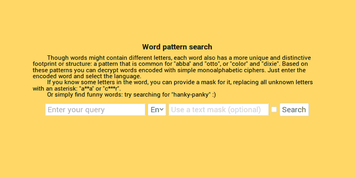

# Word patterns search
## A portable django app without a database

Though words might contain different letters, each word also has a more unique and distinctive footprint or structure: a pattern that is common for "abba" and "otto", or "color" and "dixie". Based on these patterns you can decrypt words encoded with simple monoalphabetic ciphers.
Install into a virtualenv, no need to prepopulate the database.

